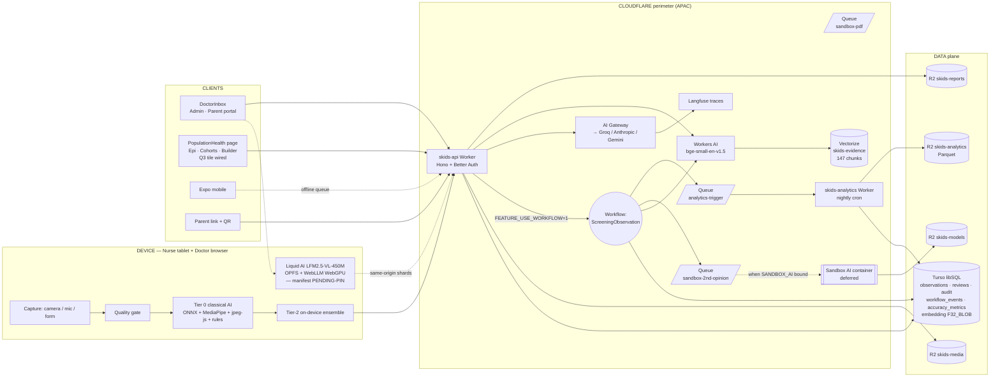
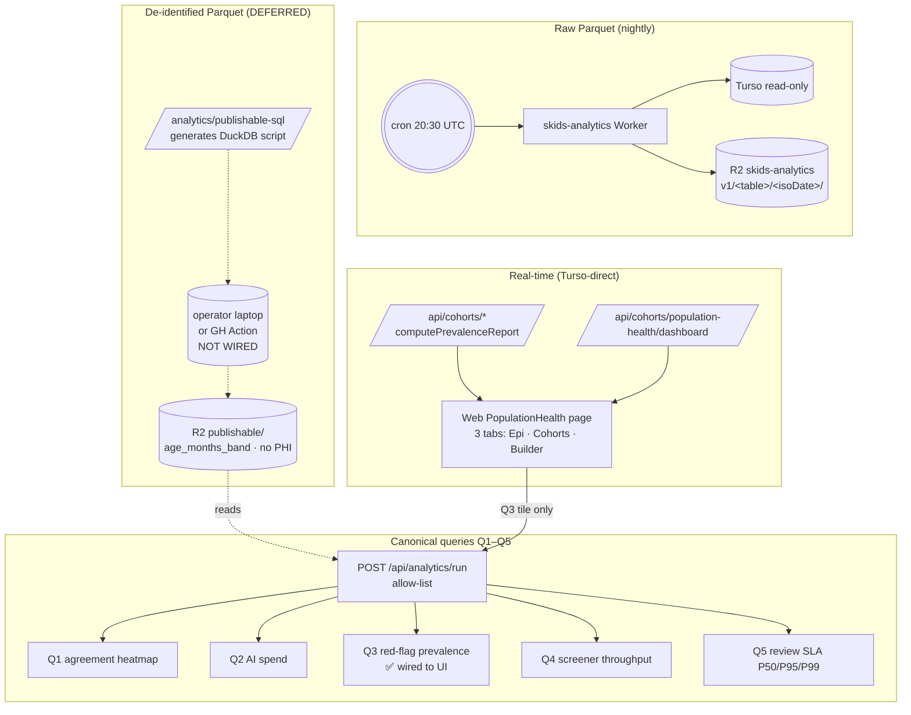
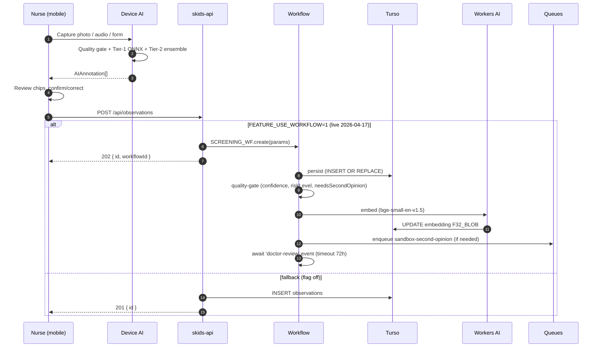
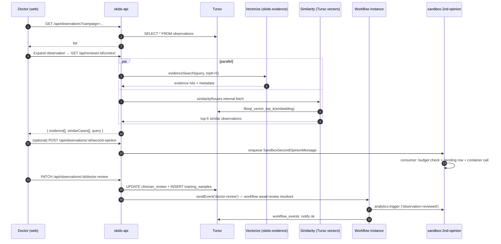
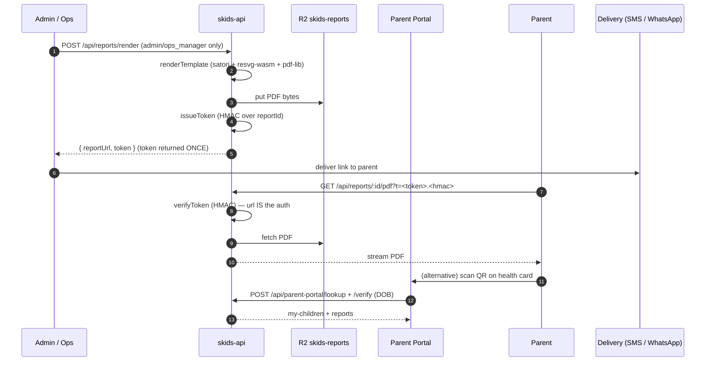
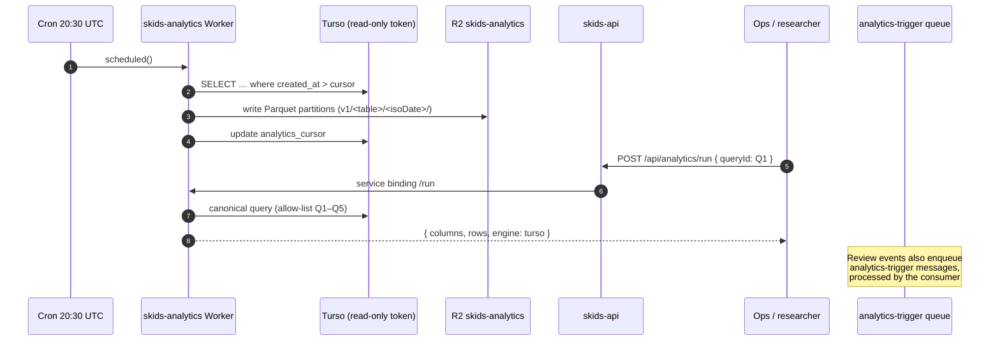
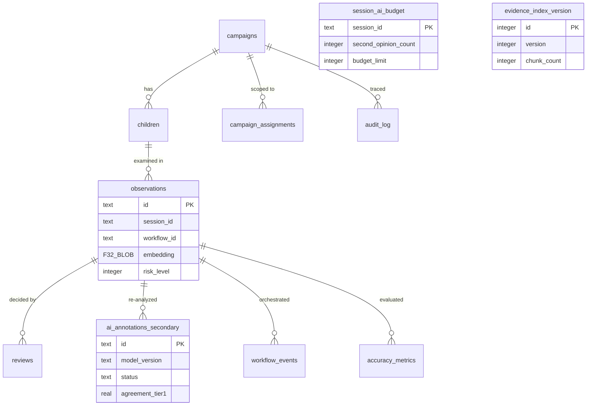

# SKIDS Edge-Stack v1 — System Blueprint

**Status:** Live in production as of 2026-04-17.
**Audience:** Tech, business, ops, clinical — this is the single source of truth.
**Supersedes:** `docs/SYSTEM_WORKFLOW.md` (historical, pre-Phase-01).

---

## 1 · What this platform does, in one paragraph

SKIDS Screen is an offline-capable pediatric screening platform. A nurse uses an Android tablet to capture vitals, imagery, and behavioural observations of a child; three tiers of AI (on-device, cloud-gateway, server-side second-opinion) classify findings; a doctor reviews flagged cases in a web inbox backed by vector-similarity + retrieval-augmented evidence; the parent receives a signed PDF report with QR-verified access; every artefact is auditable, exportable, and rolled up into a nightly analytics pipeline that clinical ops + researchers consume.

---

## 2 · Who uses it

| Persona | Surface | What they need | What they create |
|---|---|---|---|
| **Nurse** (field screener) | Expo mobile app, offline-first | Fast capture, on-device AI, sync when online | Observations, media, Tier-1 AI annotations |
| **Doctor** (reviewer) | Web DoctorInbox + mobile review | Tier-2 cloud AI, evidence, similar cases, one-click decisions | Reviews (approve/refer/follow-up/discharge/retake), second-opinion requests |
| **Parent** | Web Parent Portal + QR-signed PDF | Plain-language report in their language, anywhere | Consents, follow-up intent |
| **Admin / Ops manager** | Web admin pages | Campaign setup, user management, fleet readiness | Campaigns, assignments, reports release |
| **Clinical ops / Researcher** | Analytics dashboard, parquet exports | Aggregate metrics, cohort queries, IRB-safe data | Study cohorts, canonical-query runs |
| **Authority / District officer** | Authority dashboard | Scoped campaign visibility (assigned only) | Approvals, escalations |

---

## 3 · Stack in one glance



---

## 4 · Two on-device AI tracks worth naming

### 4A · Liquid AI on the web (Phase 02a-web)

```mermaid
flowchart LR
  Browser[Doctor / nurse browser]
  API[skids-api /api/models]
  R2M[(R2 skids-models)]
  OPFS[(OPFS cache<br/>per shard)]
  WL[WebLLM MLCEngine<br/>WebGPU]
  HITL[/api/on-device-ai/:outcome]
  A[(audit_log)]

  Browser -->|pinned MODEL_MANIFEST| API
  API --> R2M
  R2M --> API --> Browser
  Browser -->|per-shard SHA-256| OPFS
  OPFS --> WL
  WL -->|suggested / accepted / rejected / edited| HITL
  HITL --> A
```

**Why it matters:** LFM2.5-VL-450M runs on the doctor's / nurse's machine with **zero cloud egress** — no HuggingFace, no external CDN. Shards are served same-origin from our R2 under SKIDS auth, verified against a **pinned manifest** (literal constant, no dynamic "latest"), and cached in OPFS so the second session is instant. HITL outcomes (suggested → accepted/rejected/edited) are audited with model id + version pinned so we can prove who saw what.

**Live today:**
- `GET /api/models/:modelId/:version/:shard` — [apps/worker/src/routes/models.ts](apps/worker/src/routes/models.ts)
- Browser loader + OPFS + SHA verification + WebLLM wiring — [packages/liquid-ai/src/web/loader.ts](packages/liquid-ai/src/web/loader.ts)
- `POST /api/on-device-ai/:outcome` HITL audit — [apps/worker/src/routes/on-device-ai.ts](apps/worker/src/routes/on-device-ai.ts)

**Deferred:**
- **Weights not uploaded.** `MODEL_MANIFEST.version = 'PENDING-PIN-2026-04-15'`; every shard sha256 is literally `'PENDING-PIN'`. Unblocker: pin real version + sha256s, upload shards to `r2://skids-models/models/liquid-ai/LFM2.5-VL-450M/<version>/`, flip `isPlaceholderManifest()` to false. [packages/shared/src/ai/model-manifest.ts:27](packages/shared/src/ai/model-manifest.ts:27)
- **Mobile track.** Only the web runtime exists; mobile stays on ONNX/MediaPipe Tier-1 until a React Native runtime lands.

### 4B · Tier-0 on-device classical AI (shipped earlier, still primary nurse path)

ONNX photoscreening · MediaPipe face/pose · jpeg-js red-reflex + clinical color · M-CHAT / motor rule-based scoring. Runs offline on the nurse tablet, populates `AIAnnotation[]` before sync. This is what every captured observation hits first; Tier-1/2/secondary only engage when the on-device confidence says it's needed.

---

## 5 · Population health + analytics (Phase 04, layered)



**Live today:**
- Nightly Parquet export of all raw tables to R2. Cursor-driven incremental writes via `analytics_cursor`; runs logged in `analytics_runs`.
- 5 canonical queries allow-listed at [packages/shared/src/analytics/queries.sql](packages/shared/src/analytics/queries.sql), proxied through `ANALYTICS_SVC` service binding.
- `PopulationHealth` page live at `/population-health`, admin + ops_manager only: epi dashboard from Turso-direct APIs, saved cohorts, cohort builder, and the Q3 prevalence tile backed by `/api/analytics/run`.
- `computePrevalenceReport` + `population-analytics.ts` power real-time cohort comparisons without waiting for the Parquet layer.

**Deferred:**
- **Publishable de-identified Parquet is not materialized yet.** The worker emits the DuckDB SQL (`GET /analytics/publishable-sql?isoDate=…`) but the job that runs it is not scheduled — it expects an operator laptop or a GH Action. Consequence: **Q1–Q5 read from `publishable/` prefixes that are currently empty**, so Q3 tile renders empty rows in production even though the query runs. Unblocker: wire a GH Action to execute the SQL nightly with R2 secrets. [apps/analytics-worker/src/publishable.ts:1](apps/analytics-worker/src/publishable.ts:1)
- **Only Q3 tile wired in the UI.** Q1/Q2/Q4/Q5 work via the API but no React component renders them. Straightforward follow-up — the `/api/analytics/run` contract is stable.
- **MotherDuck** — originally Phase 8, now permanently deferred. External researchers query R2 Parquet directly with DuckDB.

---

## 6 · The four primary journeys

### 4.1 Nurse captures a screening



**Key latencies observed:** persist 691 ms · quality-gate 0 ms · embed 69 ms · enqueue skipped in happy path. Doctor receives the inbox row within 1 s of sync.

---

### 4.2 Doctor reviews



---

### 4.3 Parent gets their report



Cron pre-warm runs every 10 min during 03:00–12:00 UTC (= 08:30–17:30 IST) when `FEATURE_REPORT_PREWARM=1`.

---

### 4.4 Analytics + research



Canonical queries: Q1 module/age × agreement, Q2 disagreement trends, Q3 module coverage, Q4 doctor throughput, Q5 campaign-level rollup.

---

## 7 · Infrastructure inventory (live)

| Layer | Resource | Purpose | Binding / key |
|---|---|---|---|
| **Compute** | `skids-api` Worker | Main API, Hono | [apps/worker](apps/worker) |
| | `skids-analytics` Worker | Nightly Parquet + `/run` proxy | [apps/analytics-worker](apps/analytics-worker) |
| | `ScreeningObservationWorkflow` | Durable per-observation flow | binding `SCREENING_WF` |
| **Queues** | `sandbox-pdf` (+ DLQ) | Report render fan-out | `SANDBOX_PDF_Q` |
| | `sandbox-second-opinion` (+ DLQ) | ONNX re-analysis | `SANDBOX_2ND_OPINION_Q` |
| | `analytics-trigger` (+ DLQ) | Review-driven refresh | `ANALYTICS_Q` |
| **Vector** | Vectorize `skids-evidence` | 147 chunks · 384-dim cosine | `EVIDENCE_VEC` |
| | Turso native vectors | Observation embeddings `F32_BLOB(384)` | `libsql_vector_idx` |
| **AI** | Workers AI | `@cf/baai/bge-small-en-v1.5` | `AI` |
| | AI Gateway | Groq → Anthropic → Gemini overflow | `AI_GATEWAY_ID=skids-screen` |
| | Langfuse | LLM trace observability | `LANGFUSE_*` secrets |
| **Storage** | Turso `skids-screen-v3` | libSQL primary + replicas | `TURSO_URL` secret |
| | R2 `skids-media` | Nurse uploads | `R2_BUCKET` |
| | R2 `skids-reports` | Rendered PDFs | `R2_REPORTS_BUCKET` |
| | R2 `skids-models` | ONNX / Liquid AI weights | `R2_MODELS_BUCKET` |
| | R2 `skids-analytics` | Nightly Parquet | `ANALYTICS_R2` |
| **Cron** | `*/10 3-12 * * *` | Parent-window PDF pre-warm | `FEATURE_REPORT_PREWARM` |
| | `30 20 * * *` | Nightly analytics export | `FEATURE_ANALYTICS_CRON` |

---

## 8 · Feature flag registry (current state)

| Flag | Where | Value | What it gates | Rollback |
|---|---|---|---|---|
| `FEATURE_TURSO_VECTORS` | worker env | default ON | Phase 01 similarity search | set `"0"` |
| `FEATURE_AI_GATEWAY` | worker env | default ON | Phase 02 gateway routing | set `"0"` |
| `FEATURE_REPORT_PREWARM` | worker env | `0` | Phase 03 cron pre-warm | flip to `"1"` when ready |
| `FEATURE_ANALYTICS_CRON` | analytics env | `1` | Nightly Parquet export | set `"0"` |
| `FEATURE_DUCKDB_ANALYTICS` | worker env | `1` | `/api/analytics/run` | set `"0"` |
| `FEATURE_USE_WORKFLOW` | worker env | `1` | Phase 05 durable workflow | set `"0"` + redeploy |
| `FEATURE_EVIDENCE_RAG` | worker env | `1` | Phase 07 evidence search + `/context` | set `"0"` |

All flags live in `apps/worker/wrangler.toml` or `apps/analytics-worker/wrangler.toml` — toggles are git-tracked and rolled out via `wrangler deploy`.

---

## 9 · Database entities (who writes what)



Migrations live in [packages/db/src/migrations](packages/db/src/migrations). Schema snapshot is [packages/db/src/schema.sql](packages/db/src/schema.sql).

---

## 10 · Safety nets + observability

| Concern | Mechanism | Signal |
|---|---|---|
| **Nurse blocked by server** | Every observation write is idempotent + the inline path is a 1-flag rollback | `POST /api/observations` P95 < 200 ms |
| **AI hallucination** | 3-tier confidence gate: on-device → cloud → doctor | `accuracy_metrics.agreement_score` rolling |
| **Cost runaway** | `session_ai_budget` caps second-opinions at 5/session | `queue.second-opinion.budget-exhausted` audit rows |
| **Poison queue message** | 3 retries → DLQ → `audit_log` + Langfuse error trace | `queue.dlq.*` audit rows |
| **Workflow stuck** | 72 h timeout on `await-review`, then workflow records `timeout` and continues | `workflow_events.status = 'timeout'` |
| **PHI leakage** | All media stays in R2 APAC; Vectorize only stores 280-char previews of curated corpus; no patient text in Vectorize metadata | Residency doc: [docs/RESIDENCY.md](docs/RESIDENCY.md) |
| **PDF link leakage** | URL IS the auth — HMAC over `reportId` with 30-d TTL; parent DOB verification on portal | `report_access_tokens` hashed rows |
| **Audit everything** | `logAudit()` called from every write route; append-only `audit_log` | `audit_log` table |
| **LLM traces** | Every cloud AI call → AI Gateway → Langfuse | Langfuse dashboard |

---

## 11 · What's still deferred (known gaps)

| Item | Why it's deferred | Unblocker |
|---|---|---|
| **Liquid AI weights on R2** | `MODEL_MANIFEST.version = 'PENDING-PIN-2026-04-15'`; every shard `sha256 = 'PENDING-PIN'`. `isPlaceholderManifest()` returns true. | Pin real version + per-shard sha256 → `wrangler r2 object put skids-models/models/liquid-ai/LFM2.5-VL-450M/<version>/<shard>` → land the manifest diff → flip guard off. [packages/shared/src/ai/model-manifest.ts:27](packages/shared/src/ai/model-manifest.ts:27) |
| **Liquid AI mobile runtime** | Phase 02a web track shipped first; mobile (React Native) never started | Port [packages/liquid-ai/src/web](packages/liquid-ai/src/web) loader to RN (WebGPU → on-device execution provider). Same manifest pinning + OPFS-equivalent cache. |
| **Publishable de-identified Parquet job** | `apps/analytics-worker/src/publishable.ts` emits DuckDB SQL via `GET /analytics/publishable-sql?isoDate=…`, but the executor isn't scheduled. Consequence: Q1–Q5 read from empty `publishable/` prefixes and return 0 rows even though cron emits raw Parquet nightly. | Wire a GitHub Action (or Workers scheduled trigger + Fetch to a DuckDB service) that runs the generated SQL against R2 with the `s3_*` secrets. Populates `r2://skids-analytics/publishable/<view>/dt=<date>/`. |
| **Analytics UI tiles Q1/Q2/Q4/Q5** | Only Q3 red-flag prevalence is wired in [apps/web/src/pages/PopulationHealth.tsx](apps/web/src/pages/PopulationHealth.tsx). | `/api/analytics/run` contract is stable — add four React components that call it with the matching `queryId`. |
| **Sandbox AI container image** | Open-beta `[[containers]]` API + Docker image build needs host-side tooling | `docker build apps/worker/sandbox-ai` → `wrangler containers push` → uncomment `[[containers]]` in wrangler.toml. DB + consumer + UI already live. |
| **Parent SMS/WhatsApp delivery** | Out of scope for v1; report URL generation is live, last-mile is manual | Wire a delivery adapter that consumes the `POST /api/reports/render` response + sends the signed link. |
| **PDF render inside workflow** | Report render is admin-endpoint today; Phase 05 `sandbox-pdf` queue is a stub consumer | Replace [apps/worker/src/queues/consumers/sandbox-pdf.ts](apps/worker/src/queues/consumers/sandbox-pdf.ts) body with a `renderTemplate()` call. |
| **Doctor inbox SecondOpinionBadge in row header** | `ObservationContextPanel` shows it in the expand pane; row-level badge needs secondary annotation loaded in list query | Extend `GET /api/observations` select to `LEFT JOIN ai_annotations_secondary`. |
| **MotherDuck / researcher SQL** | Phase 8 originally scoped; not needed for v1 | External DuckDB reads Parquet directly — no work required. |

---

## 12 · Glossary

| Term | Meaning |
|---|---|
| **Tier 0** | Classical on-device AI (ONNX, MediaPipe, jpeg-js pixel math, rule-based M-CHAT/motor) — runs offline on the nurse tablet, <1 s |
| **Tier 1 (on-device LLM)** | Liquid AI LFM2.5-VL-450M on WebGPU via OPFS-cached shards — runs in the doctor / nurse browser, zero cloud egress |
| **Tier 2 (cloud)** | Cloud AI via AI Gateway (Groq primary, Anthropic/Gemini overflow) — doctor-only |
| **Secondary** | Server-side ONNX re-analysis in the Sandbox AI container — Phase 06, budget-gated |
| **Observation** | One captured media + AI annotation pair — the atomic clinical event |
| **Session** | A child's full screening across all modules — bounded by `session_id` |
| **Campaign** | An organisational scope (school, district, clinic week) — bounded by `campaign_code` |
| **Canonical query** | One of Q1–Q5 — allow-listed de-identified aggregates for analytics |
| **RAG** | Retrieval-augmented generation — here, evidence lookup into curated clinical corpus |
| **HMAC report token** | Signed URL for parent PDF access; URL itself carries the auth |

---

## 13 · Where to look when things break

| Symptom | First place | Runbook |
|---|---|---|
| Nurse can't sync | `skids-api` `/api/health`, Turso dashboard | [docs/RUNBOOK.md](docs/RUNBOOK.md) |
| Doctor inbox blank | `GET /api/observations` + `authMiddleware` logs | RUNBOOK |
| Workflow stuck | `wrangler workflows instances list screening-observation` | RUNBOOK Phase 05 section |
| Queue backed up | `wrangler queues consumer get <queue>` | RUNBOOK Phase 05 section |
| Evidence search empty | `wrangler vectorize info skids-evidence` · `FEATURE_EVIDENCE_RAG` value | RUNBOOK Phase 07 |
| Analytics stale | last row in `analytics_runs` + cron trigger | RUNBOOK Phase 04 |
| Second-opinion pending | `ai_annotations_secondary.status` · `SANDBOX_AI` binding present? | Deferred: container not yet deployed |

---

_Last updated: 2026-04-17 · author: edge-stack rollout · next review: after Phase 06 container ships._
